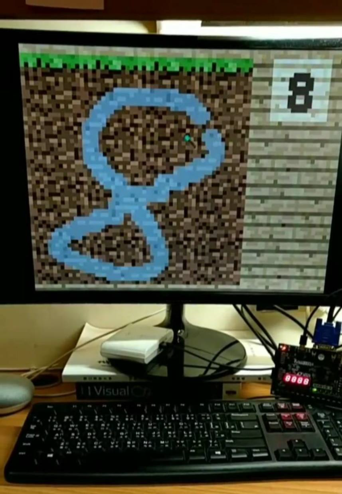
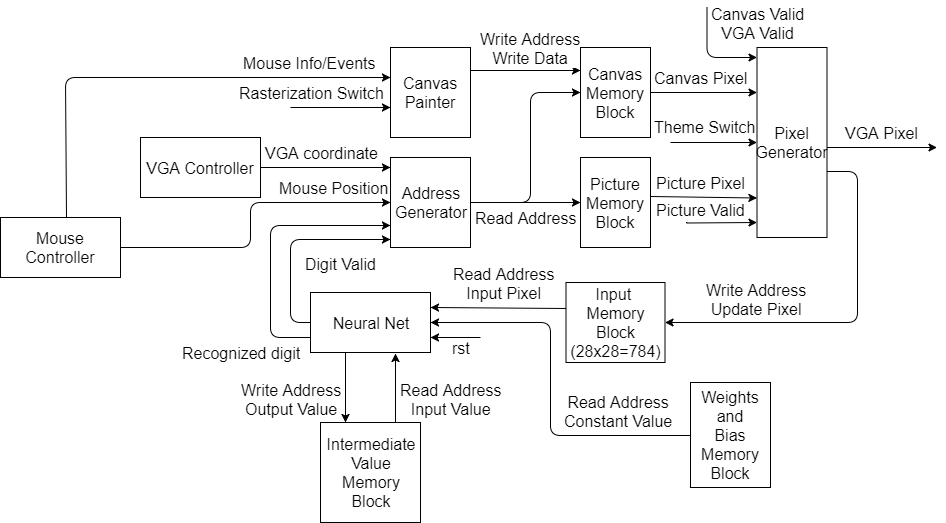

# Handwritten Digit Recognition Painter

A handwritten digit recognition painter implementation on Basys 3 Artix-7 FPGA using Verilog and a little VHDL.

## Report & Explanation

See [report.pdf](/report.pdf) for further information.

## Source

See [src](/src) in Vivado.

## Release Binaries

- [release/top.bit](/release/top.bit) is for normal use on Basys 3 Artix-7 FPGA.
- [release/top.bin](/release/top.bin) is for using SPI Flash memory to enable plug and play.

## Contributors

- [j3soon](https://github.com/j3soon)
- [tigerpaws01](https://github.com/tigerpaws01)
